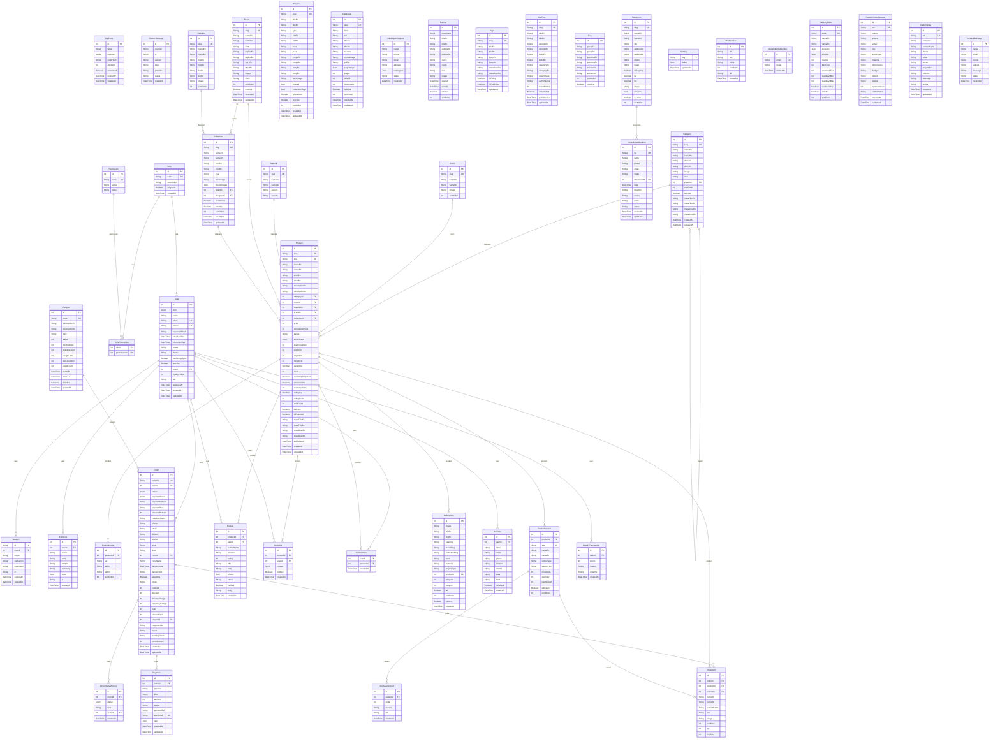

# Shekor — entity relationship diagram

Generated from `packages/db/prisma/schema.prisma` (45 models). Regenerate with `node scripts/gen-erd.mjs`.

```mermaid
erDiagram
  User {
    Int id PK
    enum kind
    String name
    String email UK
    String phone UK
    String passwordHash
    DateTime emailVerified
    DateTime phoneVerified
    String locale
    String theme
    Boolean marketingOptIn
    Boolean isActive
    Int roleId FK
    Int loyaltyPoints
    String tier
    DateTime lastLoginAt
    DateTime createdAt
    DateTime updatedAt
  }
  Role {
    Int id PK
    String name UK
    String description
    Boolean isSystem
    DateTime createdAt
  }
  Permission {
    Int id PK
    String code UK
    String group
    String label
  }
  RolePermission {
    Int roleId FK
    Int permissionId FK
  }
  Session {
    String id PK
    Int userId FK
    String scope
    String csrfSecret
    String userAgent
    String ip
    DateTime expiresAt
    DateTime createdAt
  }
  OtpCode {
    Int id PK
    String target
    String purpose
    String codeHash
    Int attempts
    Boolean consumed
    DateTime expiresAt
    DateTime createdAt
  }
  AuditLog {
    Int id PK
    Int userId FK
    String action
    String entity
    String entityId
    String summary
    Json meta
    String ip
    DateTime createdAt
  }
  OutboxMessage {
    Int id PK
    String channel
    String to
    String subject
    String body
    String provider
    String status
    DateTime createdAt
  }
  Category {
    Int id PK
    String slug UK
    String nameEn
    String nameBn
    String descEn
    String descBn
    String image
    String icon
    Int parentId FK
    Int sortOrder
    Boolean isActive
    String metaTitleEn
    String metaTitleBn
    String metaDescEn
    String metaDescBn
    DateTime createdAt
    DateTime updatedAt
  }
  Room {
    Int id PK
    String slug UK
    String nameEn
    String nameBn
    String image
    Int sortOrder
  }
  Material {
    Int id PK
    String slug UK
    String nameEn
    String nameBn
    String careEn
    String careBn
  }
  Brand {
    Int id PK
    String slug UK
    String nameEn
    String nameBn
    String kind
    String taglineEn
    String taglineBn
    String storyEn
    String storyBn
    String image
    String since
    Int sortOrder
    Boolean isActive
    DateTime createdAt
    DateTime updatedAt
  }
  Designer {
    Int id PK
    String slug UK
    String nameEn
    String nameBn
    String roleEn
    String roleBn
    String bioEn
    String bioBn
    String image
    Int sortOrder
  }
  Collection {
    Int id PK
    String slug UK
    String nameEn
    String nameBn
    String introEn
    String introBn
    String year
    String heroImage
    Json moodImages
    Int brandId FK
    Int designerId FK
    Boolean isFeatured
    Boolean isActive
    Int sortOrder
    DateTime createdAt
    DateTime updatedAt
  }
  Product {
    Int id PK
    String slug UK
    String sku UK
    String nameEn
    String nameBn
    String shortEn
    String shortBn
    String descriptionEn
    String descriptionBn
    Int categoryId FK
    Int roomId FK
    Int materialId FK
    Int brandId FK
    Int collectionId FK
    Int price
    Int compareAtPrice
    String badge
    enum stockStatus
    Int leadTimeDays
    Int widthCm
    Int depthCm
    Int heightCm
    Decimal weightKg
    Int seats
    Boolean assemblyRequired
    Boolean emiAvailable
    Int warrantyYears
    Decimal ratingAvg
    Int ratingCount
    Int soldCount
    Boolean isActive
    Boolean isFeatured
    String metaTitleEn
    String metaTitleBn
    String metaDescEn
    String metaDescBn
    DateTime publishedAt
    DateTime createdAt
    DateTime updatedAt
  }
  ProductImage {
    Int id PK
    Int productId FK
    String url
    String altEn
    String altBn
    Int sortOrder
  }
  ProductVariant {
    Int id PK
    Int productId FK
    String sku UK
    String nameEn
    String nameBn
    String optionType
    String swatchHex
    Int priceDelta
    Int stockQty
    Int lowStockAt
    Boolean isDefault
    Int sortOrder
  }
  StockMovement {
    Int id PK
    Int variantId FK
    Int delta
    String reason
    String ref
    DateTime createdAt
  }
  Review {
    Int id PK
    Int productId FK
    Int userId FK
    String authorName
    String location
    Int rating
    String title
    String body
    Json photos
    String status
    Boolean verified
    String reply
    DateTime createdAt
  }
  StockAlert {
    Int id PK
    Int productId FK
    Int userId FK
    String contact
    Boolean notified
    DateTime createdAt
  }
  WishlistItem {
    Int userId FK
    Int productId FK
    DateTime createdAt
  }
  Project {
    Int id PK
    String slug UK
    String titleEn
    String titleBn
    String type
    String cityEn
    String cityBn
    String year
    String area
    String scopeEn
    String scopeBn
    String storyEn
    String storyBn
    String heroImage
    Json images
    Json collectionSlugs
    Boolean isFeatured
    Boolean isActive
    Int sortOrder
    DateTime createdAt
    DateTime updatedAt
  }
  GalleryItem {
    Int id PK
    String image
    String titleEn
    String titleBn
    String category
    String brandSlug
    String collectionSlug
    String room
    String material
    String projectType
    Int productId FK
    Int hotspotX
    Int hotspotY
    Boolean tall
    Int sortOrder
    Boolean isActive
    DateTime createdAt
  }
  Catalogue {
    Int id PK
    String slug UK
    String kind
    String ref
    String titleEn
    String titleBn
    String season
    String coverImage
    String pdfUrl
    Json pageImages
    Int pages
    Int sizeKb
    Int downloads
    Boolean isActive
    Int sortOrder
    DateTime createdAt
    DateTime updatedAt
  }
  CatalogueRequest {
    Int id PK
    String name
    String phone
    String email
    String address
    Json catalogues
    String status
    DateTime createdAt
  }
  Banner {
    Int id PK
    String placement
    String titleEn
    String titleBn
    String subtitleEn
    String subtitleBn
    String ctaEn
    String ctaBn
    String href
    String image
    DateTime startsAt
    DateTime endsAt
    Boolean isActive
    Int sortOrder
  }
  Page {
    Int id PK
    String slug UK
    String titleEn
    String titleBn
    String bodyEn
    String bodyBn
    String metaDescEn
    String metaDescBn
    Boolean isPolicy
    Boolean isPublished
    DateTime updatedAt
  }
  BlogPost {
    Int id PK
    String slug UK
    String titleEn
    String titleBn
    String excerptEn
    String excerptBn
    String bodyEn
    String bodyBn
    String categoryEn
    String categoryBn
    String coverImage
    String authorName
    Int readMinutes
    Boolean isPublished
    DateTime publishedAt
    DateTime updatedAt
  }
  Faq {
    Int id PK
    String groupEn
    String groupBn
    String questionEn
    String questionBn
    String answerEn
    String answerBn
    Int sortOrder
    Boolean isActive
  }
  Showroom {
    Int id PK
    String slug UK
    String nameEn
    String nameBn
    String city
    String addressEn
    String addressBn
    String phone
    String hours
    Boolean isFlagship
    Decimal lat
    Decimal lng
    String image
    Json services
    Boolean isActive
    Int sortOrder
  }
  Setting {
    String key PK
    Json value
    DateTime updatedAt
  }
  MediaAsset {
    Int id PK
    String url
    String key
    String mime
    Int sizeBytes
    String alt
    DateTime createdAt
  }
  NewsletterSubscriber {
    Int id PK
    String email UK
    String locale
    DateTime createdAt
  }
  DeliveryZone {
    Int id PK
    String code UK
    String nameEn
    String nameBn
    Json divisions
    Json districts
    Int charge
    Int freeOver
    Int assemblyFee
    Int leadDaysMin
    Int leadDaysMax
    Boolean codAvailable
    Boolean isActive
    Int sortOrder
  }
  Address {
    Int id PK
    Int userId FK
    String label
    String name
    String phone
    String division
    String district
    String area
    String line1
    Boolean isDefault
    DateTime createdAt
  }
  Coupon {
    Int id PK
    String code UK
    String descriptionEn
    String descriptionBn
    String type
    Int value
    Int minSubtotal
    Int maxDiscount
    Int usageLimit
    Int perUserLimit
    Int usedCount
    DateTime startsAt
    DateTime endsAt
    Boolean isActive
    DateTime createdAt
  }
  Order {
    Int id PK
    String orderNo UK
    Int userId FK
    enum status
    enum paymentStatus
    String paymentMethod
    String paymentPlan
    Int advancePercent
    String customerName
    String phone
    String email
    String division
    String district
    String area
    String line1
    Int zoneId FK
    String zoneName
    DateTime deliveryDate
    String deliverySlot
    Boolean assembly
    String notes
    Int subtotal
    Int discount
    Int deliveryCharge
    Int assemblyCharge
    Int total
    Int amountPaid
    Int couponId FK
    String couponCode
    String locale
    String trackingToken
    Int pointsEarned
    DateTime createdAt
    DateTime updatedAt
  }
  OrderItem {
    Int id PK
    Int orderId FK
    Int productId FK
    Int variantId FK
    String nameEn
    String nameBn
    String variantName
    String sku
    String image
    Int unitPrice
    Int qty
    Int lineTotal
  }
  OrderStatusHistory {
    Int id PK
    Int orderId FK
    enum status
    String note
    Int actorId FK
    DateTime createdAt
  }
  Payment {
    Int id PK
    Int orderId FK
    String provider
    String kind
    Int amount
    String status
    String providerRef
    String sessionId UK
    Json raw
    DateTime createdAt
    DateTime updatedAt
  }
  LoyaltyTransaction {
    Int id PK
    Int userId FK
    Int points
    String reason
    String orderNo
    DateTime createdAt
  }
  CustomOrderRequest {
    Int id PK
    String ref UK
    String name
    String phone
    String email
    String city
    String pieceType
    String material
    String dimensions
    String budget
    String details
    String status
    Int quoteAmount
    String adminNotes
    DateTime createdAt
    DateTime updatedAt
  }
  ConsultationBooking {
    Int id PK
    String ref UK
    String name
    String phone
    String email
    String mode
    Int showroomId FK
    DateTime date
    String timeSlot
    String rooms
    String notes
    String status
    DateTime createdAt
    DateTime updatedAt
  }
  TradeInquiry {
    Int id PK
    String ref UK
    String company
    String contactName
    String phone
    String email
    String sector
    String projectSize
    String timeline
    String message
    String status
    DateTime createdAt
    DateTime updatedAt
  }
  ContactMessage {
    Int id PK
    String name
    String email
    String phone
    String subject
    String message
    String status
    DateTime createdAt
  }
  Role ||--o{ User : "role"
  Role ||--o{ RolePermission : "role"
  Permission ||--o{ RolePermission : "permission"
  User ||--o{ Session : "user"
  User ||--o{ AuditLog : "user"
  Category ||--o{ Category : "parent"
  Brand ||--o{ Collection : "brand"
  Designer ||--o{ Collection : "designer"
  Category ||--o{ Product : "category"
  Room ||--o{ Product : "room"
  Material ||--o{ Product : "material"
  Brand ||--o{ Product : "brand"
  Collection ||--o{ Product : "collection"
  Product ||--o{ ProductImage : "product"
  Product ||--o{ ProductVariant : "product"
  ProductVariant ||--o{ StockMovement : "variant"
  Product ||--o{ Review : "product"
  User ||--o{ Review : "user"
  Product ||--o{ StockAlert : "product"
  User ||--o{ StockAlert : "user"
  User ||--o{ WishlistItem : "user"
  Product ||--o{ WishlistItem : "product"
  Product ||--o{ GalleryItem : "product"
  User ||--o{ Address : "user"
  User ||--o{ Order : "user"
  Coupon ||--o{ Order : "coupon"
  Order ||--o{ OrderItem : "order"
  Product ||--o{ OrderItem : "product"
  ProductVariant ||--o{ OrderItem : "variant"
  Order ||--o{ OrderStatusHistory : "order"
  Order ||--o{ Payment : "order"
  User ||--o{ LoyaltyTransaction : "user"
  Showroom ||--o{ ConsultationBooking : "showroom"
```
